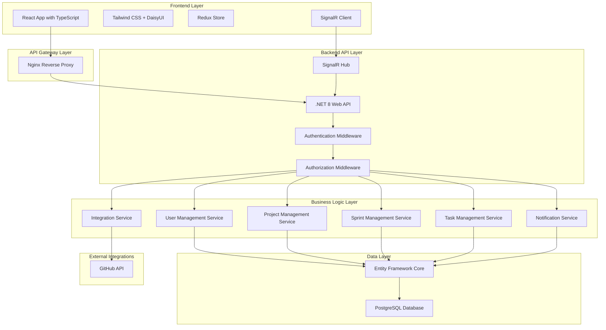
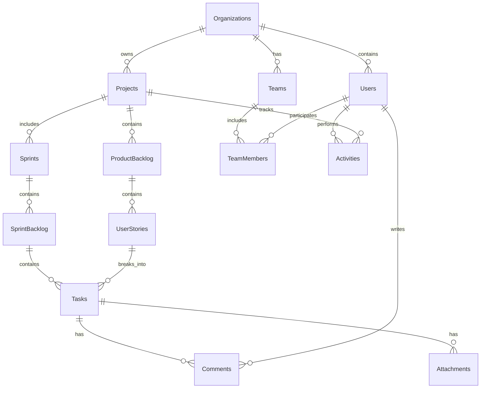

# CNC Task Management System Architecture

## Overview

This document outlines the complete system architecture for the CNC Task Management System, designed with a modern, scalable approach to support comprehensive Scrum-based project management.

## Technology Stack

### Backend
- **Framework**: .NET 8 Web API
- **Authentication**: Built-in ASP.NET Core Identity
- **Database**: PostgreSQL
- **ORM**: Entity Framework Core
- **Real-time**: SignalR
- **Testing**: xUnit, Moq
- **Documentation**: Swagger/OpenAPI

### Frontend
- **Framework**: React 18 with TypeScript
- **Styling**: Tailwind CSS + DaisyUI
- **State Management**: Redux Toolkit
- **Routing**: React Router
- **HTTP Client**: Axios
- **Real-time**: SignalR Client
- **Testing**: Jest, React Testing Library
- **Build Tool**: Vite

### DevOps & Deployment
- **Containerization**: Docker
- **Container Management**: Portainer
- **Database**: PostgreSQL (already configured)
- **Reverse Proxy**: Nginx
- **Environment**: On-premise deployment

## System Architecture

## Multi-Tenant Architecture

The system implements a multi-tenant architecture where each organization (tenant) has isolated data and configurations:

### Tenant Isolation Strategy
- **Database Schema**: Shared database, shared schema with tenant ID discrimination
- **Data Access**: All queries filtered by tenant ID
- **Security**: Tenant-specific authentication and authorization

## Database Schema Design

### Core Entities

### Key Tables

#### Organizations
- Id (Primary Key)
- Name
- Description
- Settings (JSON)
- CreatedAt
- UpdatedAt

#### Users
- Id (Primary Key)
- OrganizationId (Foreign Key)
- Email
- UserName
- FirstName
- LastName
- Role
- IsActive
- CreatedAt
- UpdatedAt

#### Projects
- Id (Primary Key)
- OrganizationId (Foreign Key)
- Name
- Description
- ProductOwnerId (Foreign Key)
- ScrumMasterId (Foreign Key)
- Status
- CreatedAt
- UpdatedAt

#### Teams
- Id (Primary Key)
- OrganizationId (Foreign Key)
- ProjectId (Foreign Key)
- Name
- Description
- CreatedAt
- UpdatedAt

#### Sprints
- Id (Primary Key)
- ProjectId (Foreign Key)
- Name
- Goal
- StartDate
- EndDate
- Status
- Capacity
- CreatedAt
- UpdatedAt

#### UserStories
- Id (Primary Key)
- ProjectId (Foreign Key)
- ProductBacklogId (Foreign Key)
- SprintId (Foreign Key, nullable)
- Title
- Description
- AcceptanceCriteria
- StoryPoints
- Priority
- Status
- CreatedAt
- UpdatedAt

#### Tasks
- Id (Primary Key)
- UserStoryId (Foreign Key)
- SprintBacklogId (Foreign Key)
- AssigneeId (Foreign Key, nullable)
- Title
- Description
- Status
- EstimatedHours
- ActualHours
- CreatedAt
- UpdatedAt

## API Design

### Authentication Endpoints
- POST /api/auth/login
- POST /api/auth/logout
- POST /api/auth/register
- GET /api/auth/profile
- PUT /api/auth/profile

### Organization Management
- GET /api/organizations
- POST /api/organizations
- GET /api/organizations/{id}
- PUT /api/organizations/{id}
- DELETE /api/organizations/{id}

### User Management
- GET /api/users
- POST /api/users
- GET /api/users/{id}
- PUT /api/users/{id}
- DELETE /api/users/{id}
- PUT /api/users/{id}/role

### Project Management
- GET /api/projects
- POST /api/projects
- GET /api/projects/{id}
- PUT /api/projects/{id}
- DELETE /api/projects/{id}

### Sprint Management
- GET /api/projects/{projectId}/sprints
- POST /api/projects/{projectId}/sprints
- GET /api/sprints/{id}
- PUT /api/sprints/{id}
- DELETE /api/sprints/{id}
- POST /api/sprints/{id}/start
- POST /api/sprints/{id}/complete

### Backlog Management
- GET /api/projects/{projectId}/backlog
- POST /api/projects/{projectId}/stories
- GET /api/stories/{id}
- PUT /api/stories/{id}
- DELETE /api/stories/{id}
- POST /api/stories/{id}/assign-to-sprint

### Task Management
- GET /api/sprints/{sprintId}/tasks
- POST /api/sprints/{sprintId}/tasks
- GET /api/tasks/{id}
- PUT /api/tasks/{id}
- DELETE /api/tasks/{id}
- PUT /api/tasks/{id}/status

### Kanban Board
- GET /api/sprints/{sprintId}/kanban
- PUT /api/tasks/{id}/move

### Real-time Communication
- SignalR Hub: /api/hubs/project
- SignalR Hub: /api/hubs/notifications

## Security Architecture

### Authentication
- ASP.NET Core Identity with JWT tokens
- Password hashing with ASP.NET Core Identity defaults
- Token expiration and refresh mechanisms

### Authorization
- Role-based access control (RBAC)
- Policy-based authorization for fine-grained permissions
- Resource-level authorization checks

### Data Security
- Encryption at rest (database level)
- Encryption in transit (HTTPS)
- Input validation and sanitization
- SQL injection prevention through EF Core

## Real-time Features

### SignalR Implementation
- Project collaboration hub
- Notification hub
- Activity feed updates
- Task status changes

## Integration Architecture

### GitHub Integration
- OAuth2 authentication
- Repository linking
- Issue synchronization
- Commit references

## Deployment Architecture

### Docker Configuration
- Multi-stage builds for optimization
- Separate containers for frontend, backend, and database
- Environment-specific configurations

### Portainer Deployment
- Container orchestration
- Volume management for persistent data
- Network configuration
- Environment variable management

## Performance Considerations

### Caching Strategy
- In-memory caching for frequently accessed data
- Distributed caching for multi-instance deployments
- Database query optimization

### Scalability
- Horizontal scaling for API instances
- Database connection pooling
- Asynchronous programming patterns

## Monitoring and Logging

### Application Logging
- Structured logging with Serilog
- Log levels and categories
- Log aggregation and analysis

### Health Checks
- ASP.NET Core Health Checks
- Database connectivity
- External service availability

## Development Workflow

### Version Control
- Git with feature branches
- Pull request workflow
- Code review process

### CI/CD Pipeline
- Automated builds
- Automated testing
- Container deployment
- Environment promotion