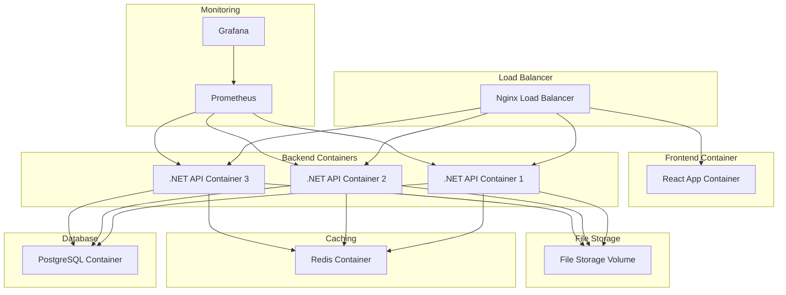

# CNC Task Management System - Deployment Guide

## Overview

This document outlines the complete deployment strategy for the CNC Task Management System, including Docker configuration, Portainer setup, and on-premise deployment considerations.

## Deployment Architecture



## Docker Configuration

### Backend Dockerfile

```dockerfile
# Backend/Dockerfile
FROM mcr.microsoft.com/dotnet/aspnet:8.0 AS base
WORKDIR /app
EXPOSE 80
EXPOSE 443

FROM mcr.microsoft.com/dotnet/sdk:8.0 AS build
WORKDIR /src
COPY ["src/CNCTaskManagement.Api/CNCTaskManagement.Api.csproj", "src/CNCTaskManagement.Api/"]
COPY ["src/CNCTaskManagement.Core/CNCTaskManagement.Core.csproj", "src/CNCTaskManagement.Core/"]
COPY ["src/CNCTaskManagement.Infrastructure/CNCTaskManagement.Infrastructure.csproj", "src/CNCTaskManagement.Infrastructure/"]
RUN dotnet restore "src/CNCTaskManagement.Api/CNCTaskManagement.Api.csproj"
COPY . .
WORKDIR "/src/src/CNCTaskManagement.Api"
RUN dotnet build "CNCTaskManagement.Api.csproj" -c Release -o /app/build

FROM build AS publish
RUN dotnet publish "CNCTaskManagement.Api.csproj" -c Release -o /app/publish /p:UseAppHost=false

FROM base AS final
WORKDIR /app
COPY --from=publish /app/publish .

# Create non-root user
RUN adduser --disabled-password --gecos '' appuser && chown -R appuser /app
USER appuser

ENTRYPOINT ["dotnet", "CNCTaskManagement.Api.dll"]
```

### Frontend Dockerfile

```dockerfile
# Frontend/Dockerfile
# Build stage
FROM node:18-alpine AS build

WORKDIR /app

# Copy package files
COPY package*.json ./
RUN npm ci --only=production

# Copy source code
COPY . .

# Build the application
RUN npm run build

# Production stage
FROM nginx:alpine AS production

# Copy built assets from build stage
COPY --from=build /app/dist /usr/share/nginx/html

# Copy nginx configuration
COPY nginx.conf /etc/nginx/nginx.conf

# Create non-root user
RUN addgroup -g 1001 -S nodejs
RUN adduser -S nextjs -u 1001

# Change ownership of the nginx directory
RUN chown -R nextjs:nodejs /var/cache/nginx && \
    chown -R nextjs:nodejs /var/log/nginx && \
    chown -R nextjs:nodejs /etc/nginx/conf.d
RUN touch /var/run/nginx.pid && \
    chown -R nextjs:nodejs /var/run/nginx.pid

# Switch to non-root user
USER nextjs

EXPOSE 80

CMD ["nginx", "-g", "daemon off;"]
```

### Nginx Configuration

```nginx
# nginx.conf
events {
    worker_connections 1024;
}

http {
    include       /etc/nginx/mime.types;
    default_type  application/octet-stream;

    # Logging
    log_format main '$remote_addr - $remote_user [$time_local] "$request" '
                    '$status $body_bytes_sent "$http_referer" '
                    '"$http_user_agent" "$http_x_forwarded_for"';
    access_log /var/log/nginx/access.log main;
    error_log /var/log/nginx/error.log warn;

    # Basic settings
    sendfile on;
    tcp_nopush on;
    tcp_nodelay on;
    keepalive_timeout 65;
    types_hash_max_size 2048;
    client_max_body_size 20M;

    # Gzip compression
    gzip on;
    gzip_vary on;
    gzip_min_length 1024;
    gzip_proxied any;
    gzip_comp_level 6;
    gzip_types
        text/plain
        text/css
        text/xml
        text/javascript
        application/json
        application/javascript
        application/xml+rss
        application/atom+xml
        image/svg+xml;

    # Rate limiting
    limit_req_zone $binary_remote_addr zone=api:10m rate=10r/s;
    limit_req_zone $binary_remote_addr zone=login:10m rate=5r/m;

    # Upstream backend servers
    upstream backend {
        least_conn;
        server backend:8080 max_fails=3 fail_timeout=30s;
        keepalive 32;
    }

    # Frontend server
    server {
        listen 80;
        server_name localhost;
        root /usr/share/nginx/html;
        index index.html;

        # Security headers
        add_header X-Frame-Options "SAMEORIGIN" always;
        add_header X-XSS-Protection "1; mode=block" always;
        add_header X-Content-Type-Options "nosniff" always;
        add_header Referrer-Policy "no-referrer-when-downgrade" always;
        add_header Content-Security-Policy "default-src 'self' http: https: data: blob: 'unsafe-inline'" always;

        # Frontend routes
        location / {
            try_files $uri $uri/ /index.html;
        }

        # API proxy
        location /api/ {
            limit_req zone=api burst=20 nodelay;
            
            proxy_pass http://backend;
            proxy_http_version 1.1;
            proxy_set_header Upgrade $http_upgrade;
            proxy_set_header Connection 'upgrade';
            proxy_set_header Host $host;
            proxy_set_header X-Real-IP $remote_addr;
            proxy_set_header X-Forwarded-For $proxy_add_x_forwarded_for;
            proxy_set_header X-Forwarded-Proto $scheme;
            proxy_cache_bypass $http_upgrade;
            
            # Timeouts
            proxy_connect_timeout 60s;
            proxy_send_timeout 60s;
            proxy_read_timeout 60s;
        }

        # SignalR WebSocket
        location /api/hubs/ {
            proxy_pass http://backend;
            proxy_http_version 1.1;
            proxy_set_header Upgrade $http_upgrade;
            proxy_set_header Connection "upgrade";
            proxy_set_header Host $host;
            proxy_set_header X-Real-IP $remote_addr;
            proxy_set_header X-Forwarded-For $proxy_add_x_forwarded_for;
            proxy_set_header X-Forwarded-Proto $scheme;
            proxy_cache_bypass $http_upgrade;
        }

        # Login rate limiting
        location /api/v1/auth/login {
            limit_req zone=login burst=5 nodelay;
            
            proxy_pass http://backend;
            proxy_http_version 1.1;
            proxy_set_header Host $host;
            proxy_set_header X-Real-IP $remote_addr;
            proxy_set_header X-Forwarded-For $proxy_add_x_forwarded_for;
            proxy_set_header X-Forwarded-Proto $scheme;
        }

        # Static files caching
        location ~* \.(js|css|png|jpg|jpeg|gif|ico|svg)$ {
            expires 1y;
            add_header Cache-Control "public, immutable";
        }
    }
}
```

### Docker Compose Configuration

```yaml
# docker-compose.yml
version: '3.8'

services:
  # PostgreSQL Database
  database:
    image: postgres:15-alpine
    container_name: cnc-database
    restart: unless-stopped
    environment:
      POSTGRES_DB: CNCTaskManagementDB
      POSTGRES_USER: postgres
      POSTGRES_PASSWORD: ${DB_PASSWORD}
      POSTGRES_INITDB_ARGS: "--encoding=UTF-8 --lc-collate=C --lc-ctype=C"
    volumes:
      - postgres_data:/var/lib/postgresql/data
      - ./database/init:/docker-entrypoint-initdb.d
    ports:
      - "5432:5432"
    networks:
      - cnc-network
    healthcheck:
      test: ["CMD-SHELL", "pg_isready -U postgres -d CNCTaskManagementDB"]
      interval: 30s
      timeout: 10s
      retries: 3

  # Redis Cache
  redis:
    image: redis:7-alpine
    container_name: cnc-redis
    restart: unless-stopped
    command: redis-server --appendonly yes --requirepass ${REDIS_PASSWORD}
    volumes:
      - redis_data:/data
    ports:
      - "6379:6379"
    networks:
      - cnc-network
    healthcheck:
      test: ["CMD", "redis-cli", "--raw", "incr", "ping"]
      interval: 30s
      timeout: 10s
      retries: 3

  # Backend API
  backend:
    build:
      context: ./backend
      dockerfile: Dockerfile
    container_name: cnc-backend
    restart: unless-stopped
    environment:
      - ASPNETCORE_ENVIRONMENT=Production
      - ConnectionStrings__DefaultConnection=Host=database;Port=5432;Database=CNCTaskManagementDB;Username=postgres;Password=${DB_PASSWORD};
      - Redis__ConnectionString=cnc-redis:6379,password=${REDIS_PASSWORD}
      - JWT__Secret=${JWT_SECRET}
      - JWT__Issuer=${JWT_ISSUER}
      - JWT__Audience=${JWT_AUDIENCE}
      - JWT__ExpirationMinutes=${JWT_EXPIRATION_MINUTES}
      - FileStorage__Path=/app/uploads
      - FileStorage__MaxFileSize=20971520
      - Logging__LogLevel__Default=Information
      - Logging__LogLevel__Microsoft.AspNetCore=Warning
    volumes:
      - uploads_data:/app/uploads
      - ./certificates:/app/certificates:ro
    ports:
      - "8080:80"
    depends_on:
      database:
        condition: service_healthy
      redis:
        condition: service_healthy
    networks:
      - cnc-network
    healthcheck:
      test: ["CMD", "curl", "-f", "http://localhost/health"]
      interval: 30s
      timeout: 10s
      retries: 3

  # Frontend
  frontend:
    build:
      context: ./frontend
      dockerfile: Dockerfile
    container_name: cnc-frontend
    restart: unless-stopped
    environment:
      - VITE_API_URL=http://localhost/api
      - VITE_SIGNALR_URL=http://localhost/api/hubs
    ports:
      - "3000:80"
    depends_on:
      - backend
    networks:
      - cnc-network
    healthcheck:
      test: ["CMD", "curl", "-f", "http://localhost"]
      interval: 30s
      timeout: 10s
      retries: 3

  # Nginx Load Balancer
  nginx:
    image: nginx:alpine
    container_name: cnc-nginx
    restart: unless-stopped
    ports:
      - "80:80"
      - "443:443"
    volumes:
      - ./nginx/nginx.conf:/etc/nginx/nginx.conf:ro
      - ./nginx/ssl:/etc/nginx/ssl:ro
      - ./nginx/logs:/var/log/nginx
    depends_on:
      - backend
      - frontend
    networks:
      - cnc-network
    healthcheck:
      test: ["CMD", "curl", "-f", "http://localhost/health"]
      interval: 30s
      timeout: 10s
      retries: 3

  # Prometheus Monitoring
  prometheus:
    image: prom/prometheus:latest
    container_name: cnc-prometheus
    restart: unless-stopped
    command:
      - '--config.file=/etc/prometheus/prometheus.yml'
      - '--storage.tsdb.path=/prometheus'
      - '--web.console.libraries=/etc/prometheus/console_libraries'
      - '--web.console.templates=/etc/prometheus/consoles'
      - '--storage.tsdb.retention.time=200h'
      - '--web.enable-lifecycle'
    volumes:
      - ./monitoring/prometheus.yml:/etc/prometheus/prometheus.yml:ro
      - prometheus_data:/prometheus
    ports:
      - "9090:9090"
    networks:
      - cnc-network
    profiles:
      - monitoring

  # Grafana Dashboard
  grafana:
    image: grafana/grafana:latest
    container_name: cnc-grafana
    restart: unless-stopped
    environment:
      - GF_SECURITY_ADMIN_USER=${GRAFANA_USER}
      - GF_SECURITY_ADMIN_PASSWORD=${GRAFANA_PASSWORD}
      - GF_USERS_ALLOW_SIGN_UP=false
    volumes:
      - grafana_data:/var/lib/grafana
      - ./monitoring/grafana/provisioning:/etc/grafana/provisioning:ro
    ports:
      - "3001:3000"
    depends_on:
      - prometheus
    networks:
      - cnc-network
    profiles:
      - monitoring

volumes:
  postgres_data:
    driver: local
  redis_data:
    driver: local
  uploads_data:
    driver: local
  prometheus_data:
    driver: local
  grafana_data:
    driver: local

networks:
  cnc-network:
    driver: bridge
    ipam:
      config:
        - subnet: 172.20.0.0/16
```

### Environment Configuration

```bash
# .env
# Database Configuration
DB_PASSWORD=your_secure_db_password_here

# Redis Configuration
REDIS_PASSWORD=your_secure_redis_password_here

# JWT Configuration
JWT_SECRET=your_jwt_secret_key_here_minimum_32_characters
JWT_ISSUER=CNC Task Management
JWT_AUDIENCE=CNC Task Management Users
JWT_EXPIRATION_MINUTES=60

# Grafana Configuration
GRAFANA_USER=admin
GRAFANA_PASSWORD=your_secure_grafana_password_here

# Application Configuration
APP_ENVIRONMENT=Production
APP_DEBUG=false
APP_URL=https://your-domain.com
```

## Portainer Configuration

### Portainer Stack Configuration

```yaml
# portainer-stack.yml
version: '3.8'

services:
  portainer:
    image: portainer/portainer-ce:latest
    container_name: portainer
    restart: always
    ports:
      - "9443:9443"
      - "9000:9000"
    volumes:
      - /var/run/docker.sock:/var/run/docker.sock
      - portainer_data:/data
    networks:
      - portainer-network

volumes:
  portainer_data:

networks:
  portainer-network:
    driver: bridge
```

### Portainer Setup Instructions

1. **Deploy Portainer**:
   ```bash
   docker-compose -f portainer-stack.yml up -d
   ```

2. **Access Portainer**:
   - Open https://localhost:9443 in your browser
   - Create admin account
   - Select local Docker environment

3. **Create CNC Stack**:
   - Navigate to "Stacks" in Portainer
   - Click "Add stack"
   - Name the stack "cnc-task-management"
   - Copy the docker-compose.yml content
   - Add environment variables
   - Deploy the stack

### Portainer Volumes Configuration

```yaml
# volumes.yml for Portainer
volumes:
  postgres_data:
    name: cnc_postgres_data
    driver: local
    driver_opts:
      type: none
      o: bind
      device: /opt/cnc/data/postgres

  redis_data:
    name: cnc_redis_data
    driver: local
    driver_opts:
      type: none
      o: bind
      device: /opt/cnc/data/redis

  uploads_data:
    name: cnc_uploads_data
    driver: local
    driver_opts:
      type: none
      o: bind
      device: /opt/cnc/data/uploads

  prometheus_data:
    name: cnc_prometheus_data
    driver: local
    driver_opts:
      type: none
      o: bind
      device: /opt/cnc/data/prometheus

  grafana_data:
    name: cnc_grafana_data
    driver: local
    driver_opts:
      type: none
      o: bind
      device: /opt/cnc/data/grafana
```

## Deployment Scripts

### Deployment Script

```bash
#!/bin/bash
# deploy.sh

set -e

# Configuration
ENVIRONMENT=${1:-production}
BACKUP_DIR="/opt/cnc/backups"
DATE=$(date +%Y%m%d_%H%M%S)

echo "🚀 Starting CNC Task Management deployment to $ENVIRONMENT environment..."

# Create necessary directories
mkdir -p $BACKUP_DIR
mkdir -p /opt/cnc/data/{postgres,redis,uploads,prometheus,grafana}
mkdir -p /opt/cnc/logs
mkdir -p /opt/cnc/certificates

# Backup database if it exists
if docker ps -q -f name=cnc-database | grep -q .; then
    echo "📦 Backing up database..."
    docker exec cnc-database pg_dump -U postgres CNCTaskManagementDB > $BACKUP_DIR/backup_$DATE.sql
fi

# Pull latest images
echo "📥 Pulling latest images..."
docker-compose -f docker-compose.yml pull

# Stop existing services
echo "⏹️ Stopping existing services..."
docker-compose -f docker-compose.yml down

# Build and start services
echo "🔨 Building and starting services..."
docker-compose -f docker-compose.yml up -d --build

# Wait for services to be healthy
echo "⏳ Waiting for services to be healthy..."
sleep 30

# Run database migrations
echo "🗄️ Running database migrations..."
docker exec cnc-backend dotnet ef database update

# Health checks
echo "🔍 Running health checks..."
if curl -f http://localhost/health; then
    echo "✅ Frontend is healthy"
else
    echo "❌ Frontend health check failed"
    exit 1
fi

if curl -f http://localhost:8080/health; then
    echo "✅ Backend is healthy"
else
    echo "❌ Backend health check failed"
    exit 1
fi

echo "🎉 Deployment completed successfully!"
echo "🌐 Application is available at: http://localhost"
echo "📊 Grafana is available at: http://localhost:3001"
echo "📈 Prometheus is available at: http://localhost:9090"
```

### Backup Script

```bash
#!/bin/bash
# backup.sh

set -e

BACKUP_DIR="/opt/cnc/backups"
DATE=$(date +%Y%m%d_%H%M%S)
RETENTION_DAYS=30

echo "📦 Starting backup process..."

# Create backup directory
mkdir -p $BACKUP_DIR

# Backup database
echo "🗄️ Backing up database..."
docker exec cnc-database pg_dump -U postgres CNCTaskManagementDB > $BACKUP_DIR/database_$DATE.sql

# Backup uploads
echo "📁 Backing up uploads..."
tar -czf $BACKUP_DIR/uploads_$DATE.tar.gz -C /opt/cnc/data uploads

# Backup configuration files
echo "⚙️ Backing up configuration..."
tar -czf $BACKUP_DIR/config_$DATE.tar.gz .env docker-compose.yml nginx/

# Clean old backups
echo "🧹 Cleaning old backups..."
find $BACKUP_DIR -name "*.sql" -mtime +$RETENTION_DAYS -delete
find $BACKUP_DIR -name "*.tar.gz" -mtime +$RETENTION_DAYS -delete

echo "✅ Backup completed successfully!"
echo "📂 Backup location: $BACKUP_DIR"
```

### Restore Script

```bash
#!/bin/bash
# restore.sh

set -e

BACKUP_FILE=$1
BACKUP_DIR="/opt/cnc/backups"

if [ -z "$BACKUP_FILE" ]; then
    echo "❌ Please provide backup file path"
    echo "Usage: ./restore.sh <backup_file>"
    exit 1
fi

echo "🔄 Starting restore process..."

# Stop services
echo "⏹️ Stopping services..."
docker-compose down

# Restore database
if [[ $BACKUP_FILE == *.sql ]]; then
    echo "🗄️ Restoring database..."
    docker-compose up -d database
    sleep 10
    docker exec -i cnc-database psql -U postgres -d CNCTaskManagementDB < $BACKUP_FILE
fi

# Restore uploads
if [[ $BACKUP_FILE == uploads_*.tar.gz ]]; then
    echo "📁 Restoring uploads..."
    tar -xzf $BACKUP_FILE -C /opt/cnc/data/
fi

# Start all services
echo "🚀 Starting services..."
docker-compose up -d

echo "✅ Restore completed successfully!"
```

## SSL/TLS Configuration

### Let's Encrypt Setup

```bash
#!/bin/bash
# setup-ssl.sh

DOMAIN=${1:-localhost}
EMAIL=${2:-admin@localhost}

# Install Certbot
apt-get update
apt-get install -y certbot python3-certbot-nginx

# Generate SSL certificate
certbot --nginx -d $DOMAIN --email $EMAIL --agree-tos --non-interactive

# Setup auto-renewal
echo "0 12 * * * /usr/bin/certbot renew --quiet" | crontab -

# Copy certificates to nginx directory
cp /etc/letsencrypt/live/$DOMAIN/fullchain.pem ./nginx/ssl/
cp /etc/letsencrypt/live/$DOMAIN/privkey.pem ./nginx/ssl/

echo "✅ SSL certificate setup completed for $DOMAIN"
```

### Nginx SSL Configuration

```nginx
# nginx-ssl.conf
server {
    listen 80;
    server_name your-domain.com;
    return 301 https://$server_name$request_uri;
}

server {
    listen 443 ssl http2;
    server_name your-domain.com;

    ssl_certificate /etc/nginx/ssl/fullchain.pem;
    ssl_certificate_key /etc/nginx/ssl/privkey.pem;
    
    # SSL configuration
    ssl_protocols TLSv1.2 TLSv1.3;
    ssl_ciphers ECDHE-RSA-AES256-GCM-SHA512:DHE-RSA-AES256-GCM-SHA512:ECDHE-RSA-AES256-GCM-SHA384:DHE-RSA-AES256-GCM-SHA384;
    ssl_prefer_server_ciphers off;
    ssl_session_cache shared:SSL:10m;
    ssl_session_timeout 10m;

    # Security headers
    add_header Strict-Transport-Security "max-age=31536000; includeSubDomains" always;
    add_header X-Frame-Options "SAMEORIGIN" always;
    add_header X-XSS-Protection "1; mode=block" always;
    add_header X-Content-Type-Options "nosniff" always;
    add_header Referrer-Policy "no-referrer-when-downgrade" always;
    add_header Content-Security-Policy "default-src 'self' http: https: data: blob: 'unsafe-inline'" always;

    # ... rest of the configuration
}
```

## Monitoring and Logging

### Prometheus Configuration

```yaml
# monitoring/prometheus.yml
global:
  scrape_interval: 15s
  evaluation_interval: 15s

rule_files:
  # - "first_rules.yml"
  # - "second_rules.yml"

scrape_configs:
  - job_name: 'prometheus'
    static_configs:
      - targets: ['localhost:9090']

  - job_name: 'cnc-backend'
    static_configs:
      - targets: ['backend:8080']
    metrics_path: '/metrics'
    scrape_interval: 30s

  - job_name: 'nginx'
    static_configs:
      - targets: ['nginx:80']
    metrics_path: '/metrics'
    scrape_interval: 30s

  - job_name: 'postgres'
    static_configs:
      - targets: ['database:5432']
    scrape_interval: 30s

  - job_name: 'redis'
    static_configs:
      - targets: ['redis:6379']
    scrape_interval: 30s
```

### Grafana Dashboard Configuration

```json
{
  "dashboard": {
    "title": "CNC Task Management Dashboard",
    "panels": [
      {
        "title": "API Response Time",
        "type": "graph",
        "targets": [
          {
            "expr": "histogram_quantile(0.95, rate(http_request_duration_seconds_bucket[5m]))",
            "legendFormat": "95th percentile"
          }
        ]
      },
      {
        "title": "Database Connections",
        "type": "graph",
        "targets": [
          {
            "expr": "pg_stat_database_numbackends",
            "legendFormat": "Active Connections"
          }
        ]
      }
    ]
  }
}
```

## Performance Optimization

### Docker Optimization

```dockerfile
# Multi-stage build optimization
FROM mcr.microsoft.com/dotnet/sdk:8.0 AS build
WORKDIR /src

# Copy only project files first for better layer caching
COPY ["src/CNCTaskManagement.Api/CNCTaskManagement.Api.csproj", "src/CNCTaskManagement.Api/"]
COPY ["src/CNCTaskManagement.Core/CNCTaskManagement.Core.csproj", "src/CNCTaskManagement.Core/"]
COPY ["src/CNCTaskManagement.Infrastructure/CNCTaskManagement.Infrastructure.csproj", "src/CNCTaskManagement.Infrastructure/"]
RUN dotnet restore "src/CNCTaskManagement.Api/CNCTaskManagement.Api.csproj"

# Copy source code
COPY . .

# Build and publish
RUN dotnet publish "src/CNCTaskManagement.Api/CNCTaskManagement.Api.csproj" -c Release -o /app/publish /p:UseAppHost=false

# Final stage with minimal runtime
FROM mcr.microsoft.com/dotnet/aspnet:8.0-alpine AS final
WORKDIR /app

# Install healthcheck tools
RUN apk add --no-cache curl

# Copy published app
COPY --from=build /app/publish .

# Create non-root user
RUN addgroup -g 1001 -S appgroup && adduser -u 1001 -S appuser -G appgroup
USER appuser

# Health check
HEALTHCHECK --interval=30s --timeout=3s --start-period=5s --retries=3 \
  CMD curl -f http://localhost:80/health || exit 1

EXPOSE 80

ENTRYPOINT ["dotnet", "CNCTaskManagement.Api.dll"]
```

### Resource Limits

```yaml
# docker-compose.prod.yml
version: '3.8'

services:
  backend:
    deploy:
      resources:
        limits:
          cpus: '1.0'
          memory: 1G
        reservations:
          cpus: '0.5'
          memory: 512M
    restart: unless-stopped
    environment:
      - ASPNETCORE_PROCESS_COUNT=2
      - ASPNETCORE_PREFERSERVERSOCKETSTRUE=true

  database:
    deploy:
      resources:
        limits:
          cpus: '2.0'
          memory: 2G
        reservations:
          cpus: '1.0'
          memory: 1G
    environment:
      - POSTGRES_SHARED_PRELOAD_LIBRARIES=pg_stat_statements
      - POSTGRES_MAX_CONNECTIONS=200
```

## Security Configuration

### Security Hardening

```bash
#!/bin/bash
# security-hardening.sh

# Remove unnecessary packages
apt-get remove -y telnet ftp rsh rlogin

# Update system
apt-get update && apt-get upgrade -y

# Configure firewall
ufw --force enable
ufw allow 22/tcp
ufw allow 80/tcp
ufw allow 443/tcp
ufw deny 5432/tcp
ufw deny 6379/tcp
ufw deny 8080/tcp
ufw deny 9090/tcp
ufw deny 3001/tcp

# Setup fail2ban
apt-get install -y fail2ban
cat > /etc/fail2ban/jail.local << EOF
[DEFAULT]
bantime = 3600
findtime = 600
maxretry = 5

[sshd]
enabled = true
port = ssh
filter = sshd
logpath = /var/log/auth.log
maxretry = 3

[nginx-http-auth]
enabled = true
filter = nginx-http-auth
logpath = /var/log/nginx/error.log
maxretry = 3
EOF

systemctl enable fail2ban
systemctl start fail2ban

echo "✅ Security hardening completed"
```

### Docker Security

```yaml
# docker-compose.security.yml
version: '3.8'

services:
  backend:
    security_opt:
      - no-new-privileges:true
    read_only: true
    tmpfs:
      - /tmp
      - /var/log
    user: "1001:1001"
    cap_drop:
      - ALL
    cap_add:
      - NET_BIND_SERVICE

  database:
    security_opt:
      - no-new-privileges:true
    user: "999:999"
    cap_drop:
      - ALL
    cap_add:
      - CHOWN
      - SETGID
      - SETUID
```

This deployment guide provides a comprehensive foundation for deploying the CNC Task Management System on-premise with Docker and Portainer, including security, monitoring, and performance optimizations.