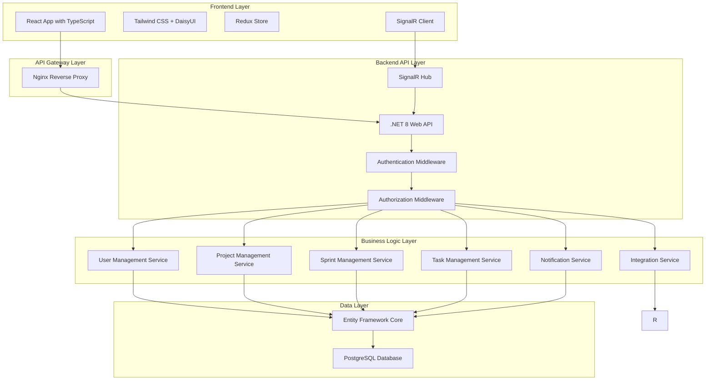

# CNC Task Management System

A comprehensive Scrum-based project management application with modern React frontend and robust .NET backend, designed for on-premise deployment with Docker and Portainer.

## 🚀 Overview

The CNC Task Management System is a full-featured Agile project management platform that supports complete Scrum workflows, real-time collaboration, and advanced reporting capabilities. Built with a multi-tenant architecture, it's perfect for organizations of all sizes looking to streamline their development processes.

## ✨ Key Features

### 🏗️ Core Project Management
- **Complete Scrum Workflow**: Sprint planning, backlog management, and retrospectives
- **Product & Sprint Backlogs**: User story prioritization with story point estimation
- **Task Management**: Detailed task breakdown with time tracking and dependency mapping
- **Kanban Boards**: Drag-and-drop interface with customizable swimlanes and WIP limits

### 👥 Team Collaboration
- **Real-time Updates**: Live collaboration with WebSocket connections
- **Activity Feeds**: Comprehensive activity tracking with configurable notifications
- **Threaded Comments**: Rich commenting system with @mentions and file attachments
- **Team Organization**: Nested team structures with cross-functional assignments

### 📊 Analytics & Reporting
- **Burndown/Burnup Charts**: Real-time sprint progress visualization
- **Velocity Tracking**: Team performance metrics and release forecasting
- **Cumulative Flow Diagrams**: Workflow efficiency analysis
- **Custom Reports**: Flexible report builder with export capabilities

### 🔐 Security & Administration
- **Role-based Access Control**: Granular permissions for Scrum Master, Product Owner, Developer, and Stakeholder roles
- **Multi-tenant Architecture**: Secure organization isolation
- **Audit Logging**: Comprehensive activity tracking
- **SSO Integration**: Support for various authentication providers

### 🔌 Integrations
- **GitHub Integration**: Repository linking, issue synchronization, and commit references
- **API Access**: RESTful API with webhooks for custom integrations
- **Extensible Architecture**: Plugin system for additional integrations

## 🛠️ Technology Stack

### Backend
- **.NET 8**: Modern, high-performance web framework
- **PostgreSQL**: Robust relational database
- **Entity Framework Core**: ORM for data access
- **SignalR**: Real-time communication
- **ASP.NET Core Identity**: Authentication and authorization

### Frontend
- **React 18**: Modern UI library with TypeScript
- **Tailwind CSS + DaisyUI**: Utility-first styling with component library
- **Redux Toolkit**: State management
- **React Query**: Server state management
- **React Beautiful DND**: Drag-and-drop functionality

### DevOps & Deployment
- **Docker**: Containerization
- **Portainer**: Container management
- **Nginx**: Reverse proxy and load balancing
- **Prometheus + Grafana**: Monitoring and visualization

## 📋 System Requirements

### Minimum Requirements
- **CPU**: 4 cores
- **Memory**: 8GB RAM
- **Storage**: 50GB available space
- **OS**: Linux (Ubuntu 20.04+), Windows Server 2019+, or macOS 10.15+

### Recommended Requirements
- **CPU**: 8 cores
- **Memory**: 16GB RAM
- **Storage**: 100GB SSD
- **Network**: 1Gbps connection

### Software Dependencies
- **Docker**: 20.10+
- **Docker Compose**: 2.0+
- **Portainer**: 2.0+ (optional but recommended)

## 🚀 Quick Start

### Prerequisites

1. **Install Docker and Docker Compose**
   ```bash
   # Linux
   sudo apt-get update
   sudo apt-get install docker.io docker-compose-plugin
   
   # macOS and Windows: Install Docker Desktop
   ```

2. **Install Portainer (Optional but Recommended)**
   ```bash
   docker volume create portainer_data
   docker run -d -p 8000:8000 -p 9443:9443 --name portainer --restart=always -v /var/run/docker.sock:/var/run/docker.sock -v portainer_data:/data portainer/portainer-ce:latest
   ```

### Installation

1. **Clone the Repository**
   ```bash
   git clone https://github.com/your-org/CNCTaskManagement.git
   cd CNCTaskManagement
   ```

2. **Configure Environment Variables**
   ```bash
   cp .env.example .env
   # Edit .env with your configuration
   ```

3. **Deploy with Docker Compose**
   ```bash
   docker-compose up -d
   ```

4. **Run Database Migrations**
   ```bash
   docker-compose exec backend dotnet ef database update
   ```

5. **Access the Application**
   - Frontend: http://localhost
   - API: http://localhost/api
   - Grafana: http://localhost:3001 (admin/admin)
   - Portainer: https://localhost:9443

### Initial Setup

1. **Create Admin Account**
   - Navigate to http://localhost/auth/register
   - Create the first organization and admin account

2. **Configure Your Organization**
   - Set up organization details
   - Configure user roles and permissions
   - Customize workspace settings

3. **Create Your First Project**
   - Navigate to Projects → Create Project
   - Set up team members and roles
   - Configure sprint settings

## 📚 Documentation

### Architecture & Design
- [**Architecture Overview**](ARCHITECTURE.md) - System architecture and design principles
- [**Database Schema**](DATABASE_SCHEMA.md) - Complete database design and relationships
- [**Project Structure**](PROJECT_STRUCTURE.md) - Code organization and file structure

### API & Frontend
- [**API Specification**](API_SPECIFICATION.md) - RESTful API documentation
- [**Frontend Specification**](FRONTEND_SPECIFICATION.md) - React frontend architecture

### Deployment & Operations
- [**Deployment Guide**](DEPLOYMENT_GUIDE.md) - Complete deployment instructions
- [**Configuration Guide**](docs/CONFIGURATION.md) - Configuration options
- [**Monitoring Guide**](docs/MONITORING.md) - Monitoring and logging setup

## 🏗️ Architecture Overview



## 🔧 Development

### Backend Development

1. **Prerequisites**
   ```bash
   .NET 8 SDK
   PostgreSQL 15+
   Node.js 18+ (for frontend)
   ```

2. **Setup Development Environment**
   ```bash
   cd backend
   dotnet restore
   dotnet build
   ```

3. **Run Backend Locally**
   ```bash
   dotnet run --project src/CNCTaskManagement.Api
   ```

4. **Run Tests**
   ```bash
   dotnet test
   ```

### Frontend Development

1. **Setup Development Environment**
   ```bash
   cd frontend
   npm install
   ```

2. **Run Frontend Locally**
   ```bash
   npm run dev
   ```

3. **Run Tests**
   ```bash
   npm test
   ```

4. **Build for Production**
   ```bash
   npm run build
   ```

### Database Development

1. **Create Migration**
   ```bash
   dotnet ef migrations add MigrationName --project src/CNCTaskManagement.Infrastructure
   ```

2. **Apply Migration**
   ```bash
   dotnet ef database update --project src/CNCTaskManagement.Infrastructure
   ```

3. **Reset Database**
   ```bash
   dotnet ef database drop --project src/CNCTaskManagement.Infrastructure
   dotnet ef database update --project src/CNCTaskManagement.Infrastructure
   ```

## 🧪 Testing

### Test Coverage
- **Backend**: Unit tests, integration tests, and API tests
- **Frontend**: Component tests, integration tests, and E2E tests
- **Database**: Migration tests and data integrity tests

### Running Tests

```bash
# Backend tests
cd backend
dotnet test

# Frontend tests
cd frontend
npm test

# E2E tests
cd frontend
npm run test:e2e
```

### Test Reports

Test coverage reports are generated in:
- Backend: `backend/TestResults/coverage.html`
- Frontend: `frontend/coverage/lcov-report/index.html`

## 📊 Monitoring

### Health Checks

- **Frontend**: http://localhost/health
- **Backend**: http://localhost:8080/health
- **Database**: PostgreSQL health check
- **Redis**: Redis ping check

### Metrics

- **Prometheus**: http://localhost:9090
- **Grafana**: http://localhost:3001
- **Application Metrics**: Custom metrics for business logic

### Logging

- **Application Logs**: Structured logging with Serilog
- **Access Logs**: Nginx access logs
- **Error Logs**: Centralized error tracking
- **Audit Logs**: User activity tracking

## 🔒 Security

### Authentication & Authorization
- JWT-based authentication
- Role-based access control (RBAC)
- Multi-factor authentication support
- Session management

### Data Protection
- Encryption at rest and in transit
- Input validation and sanitization
- SQL injection prevention
- XSS protection

### Compliance
- GDPR compliance features
- Data retention policies
- Audit trail for all actions
- Privacy controls

## 🤝 Contributing

We welcome contributions! Please see our [Contributing Guide](CONTRIBUTING.md) for details.

### Development Workflow

1. Fork the repository
2. Create a feature branch
3. Make your changes
4. Add tests for new functionality
5. Ensure all tests pass
6. Submit a pull request

### Code Style

- **Backend**: Follow Microsoft C# coding conventions
- **Frontend**: Follow ESLint and Prettier configurations
- **Commits**: Follow conventional commit message format

## 📝 License

This project is licensed under the MIT License - see the [LICENSE](LICENSE) file for details.

## 🆘 Support

### Documentation
- [FAQ](docs/FAQ.md)
- [Troubleshooting Guide](docs/TROUBLESHOOTING.md)
- [API Reference](API_SPECIFICATION.md)

### Community
- [GitHub Discussions](https://github.com/your-org/CNCTaskManagement/discussions)
- [Issues](https://github.com/your-org/CNCTaskManagement/issues)
- [Wiki](https://github.com/your-org/CNCTaskManagement/wiki)

### Professional Support
For enterprise support, custom development, or consulting services, please contact:
- Email: support@cnc-taskmanagement.com
- Website: https://cnc-taskmanagement.com

## 🗺️ Roadmap

### Version 1.0 (Current)
- ✅ Core Scrum functionality
- ✅ Multi-tenant architecture
- ✅ Real-time collaboration
- ✅ Basic reporting

### Version 1.1 (Q2 2024)
- 🔄 Advanced reporting and analytics
- 🔄 Mobile app (React Native)
- 🔄 Advanced integrations (Jira, Slack)
- 🔄 Custom workflows

### Version 2.0 (Q4 2024)
- 📋 AI-powered insights
- 📋 Advanced resource management
- 📋 Portfolio management
- 📋 Advanced security features

## 📈 Performance

### Benchmarks
- **API Response Time**: < 200ms (95th percentile)
- **Database Query Time**: < 100ms (average)
- **Frontend Load Time**: < 2 seconds
- **Concurrent Users**: 1000+ supported

### Scaling
- **Horizontal Scaling**: Multiple API instances
- **Database Scaling**: Read replicas and connection pooling
- **Caching**: Redis for session and data caching
- **CDN**: Static asset distribution

## 🏆 Acknowledgments

- **.NET Team** for the excellent framework
- **React Team** for the amazing UI library
- **PostgreSQL Team** for the robust database
- **Open Source Community** for all the amazing tools and libraries

---

**Built with ❤️ by the CNC Task Management Team**